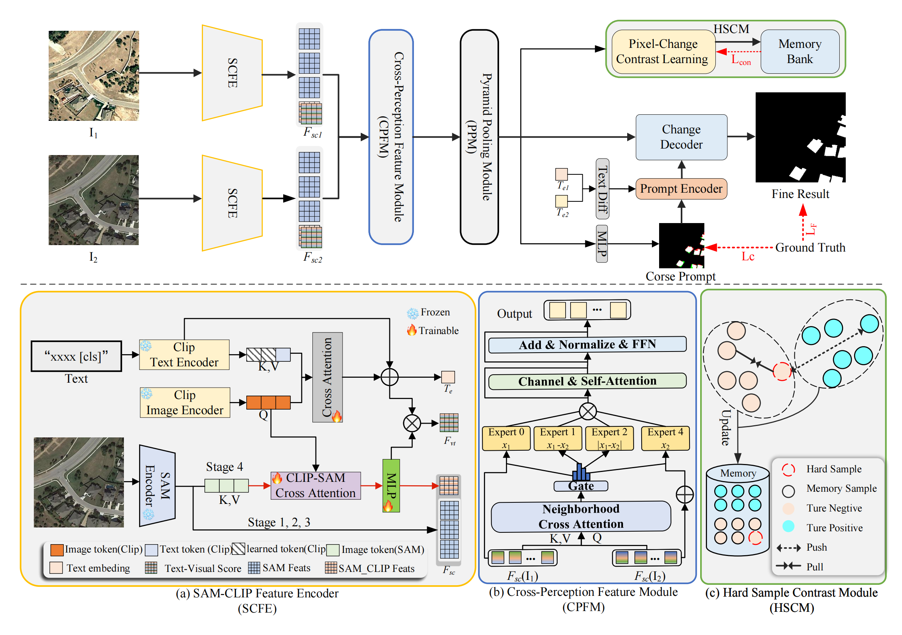

# ChangeFine: Fine-Grained Remote Sensing Change Detection via Change-Guided Contrastive Prompt Learning with SAM-CLIP

Official PyTorch implementation of ChangeFine:<br>
**[ChangeFine: Fine-Grained Remote Sensing Change Detection via Change-Guided Contrastive Prompt Learning with SAM-CLIP]()**
<br>
Kai Deng*, Siyuan Wei*, Xiangyun Hu<br>
(*Equal contribution)<br>

Abstract: Change detection is crucial for remote sensing applications, widely used in urban planning, environmental monitoring, and disaster response. However, existing change detection methods face several challenges, such as difficulty in distinguishing suspected change features, ambiguous boundaries, and inconsistencies in multi-scale features.
To address these issues, we propose a binary change detection method called ChangeFine. This method effectively fuses the detailed features extracted by SAM and the semantic priors provided by CLIP, combined with adaptive mixture-of-experts fusion and change prompt guidance, achieving precise and fine-grained change localization in bi-temporal remote sensing imagery.
Specifically, we design the SAM-CLIP Feature Encoder (SCFE), which bridges the modality gap between structural perception and semantic understanding. We introduce the Cross-Perception Feature Module (CPFM), which integrates gated mixture-of-experts and channel–spatial attention mechanisms, enabling fine-grained interaction and adaptive fusion between bi-temporal features, and effectively enhancing the extraction of change-specific features. To handle ambiguous regions (i.e., hard pixels), we introduce the Hard Sample Contrast Module (HSCM), which dynamically identifies highly uncertain samples and helps the model accurately learn discriminative boundaries. Furthermore, inspired by the concept of semantic evolution, we design the Prompt Change Decoder (PCD), which progressively integrates explicit predictions with implicit semantic differences to refine the reconstruction of change regions, achieving a coarse-to-fine change localization.
Extensive experiments conducted on four public remote sensing change detection datasets demonstrate that ChangeFine achieves significant improvements in both accuracy and robustness. The code and datasets are available at https://github.com/whudk/ChangeFine.

<div align='center'>

</div>

⚙️ Requirements
Clone the repository and set up the environment:
```bash
git clone https://github.com/your-repository/ChangeFine.git
cd ChangeFine
conda create -n changefine python=3.8
conda activate changefine
pip install -r requirements.txt
```

### 📁 Dataset Structure

Before training the **ChangeFine** model, you need to organize your dataset in the following structure:

```text
dataset/
├── train/
│   ├── A/                 # Pre-change images (t1)
│   │   ├── xxx.png
│   │   └── ...
│   ├── B/                 # Post-change images (t2)
│   │   ├── xxx.png
│   │   └── ...
│   └── label/             # Change labels
│       ├── xxx.png
│       └── ...
├── val/
│   ├── A/
│   ├── B/
│   └── label/
```


🔄 Convert Dataset to JSON
```bash
python scripts/cd2json.py --dir [path to dataset] --output_json [output json path (.eg WHUCD.json)]
```
Example:
```bash
python scripts/cd2json.py --dir /path/to/dataset --output_json /path/to/save/WHUCD.json
```


📦 Download Datasets
The five datasets used in this paper are available via the following cloud drive link:
Baidu Netdisk: https://pan.baidu.com/s/1mjZyELXo-oksg3ViOXHaZQ?pwd=whdk
Extraction Code: whdk

🚀 Pretrained Models
Download and place the following models in the pretrained/ directory:

🔸 ViT-B/16
Path: pretrained/vit_b16.pth

Baidu Netdisk: https://pan.baidu.com/s/170fxHKtMUxcDbuSkrARA5A?pwd=whdk

Code: whdk

🔸 SAM-B/16
Path: pretrained/sam_checkpoints/

Baidu Netdisk: https://pan.baidu.com/s/1DVqOGvVWyQgqMrRbEVELVA?pwd=whdk

Code: whdk

🏋️‍♀️ Training
```bash
python main.py --phase train \
               --configs [path to config] \
               --gpu 0 \
               --suptxt [path to train.json] \
               --valtxt [path to val.json] \
               --net_prompt clipsam
```
Example:
```bash
python main.py --phase train \
               --configs ./configs/default_config.yml \
               --gpu 0 \
               --suptxt ./dataset/train.json \
               --valtxt ./dataset/val.json \
               --net_prompt clipsam
```
🧪 Evaluation & Visualization
```bash
python main.py --phase test \
               --configs [path to config] \
               --gpu 0 \
               --suptxt [path to train.json] \
               --valtxt [path to val.json] \
               --net_prompt clipsam \
               --visualizer [0 or 1] \
               --resume [path to checkpoint]
```
Example (with visualization):
```bash
python main.py --phase test \
               --configs ./configs/default_config.yml \
               --gpu 0 \
               --suptxt ./dataset/train.json \
               --valtxt ./dataset/val.json \
               --net_prompt clipsam \
               --visualizer 1
```

[//]: # (## Pretrained Models)

[//]: # (We provide pretrained models of MaskDiT for ImageNet256 and ImageNet512 in the following table. For FID with guidance, the guidance scale is set to 1.5 by default.)

[//]: # (| Guidance | Resolution | FID   | Model                                                                                                                     |)

[//]: # (| :------- | :--------- | :---- | :------------------------------------------------------------------------------------------------------------------------ |)

[//]: # (| Yes      | 256x256    | 2.28  | [imagenet256-guidance.pt]&#40;https://slurm-ord.s3.amazonaws.com/ckpts/256/imagenet256-ckpt-best_with_guidance.pt&#41;       |)

[//]: # (| No       | 256x256    | 5.69  | [imagenet256-conditional.pt]&#40;https://slurm-ord.s3.amazonaws.com/ckpts/256/imagenet256-ckpt-best_without_guidance.pt&#41; |)

[//]: # (| Yes      | 512x512    | 2.50  | [imagenet512-guidance.pt]&#40;https://slurm-ord.s3.amazonaws.com/ckpts/512/1080000.pt&#41;                                   |)

[//]: # (| No       | 512x512    | 10.79 | [imagenet512-conditional.pt]&#40;https://slurm-ord.s3.amazonaws.com/ckpts/512/1050000.pt&#41;                                 |       )

### Citation
```

```


